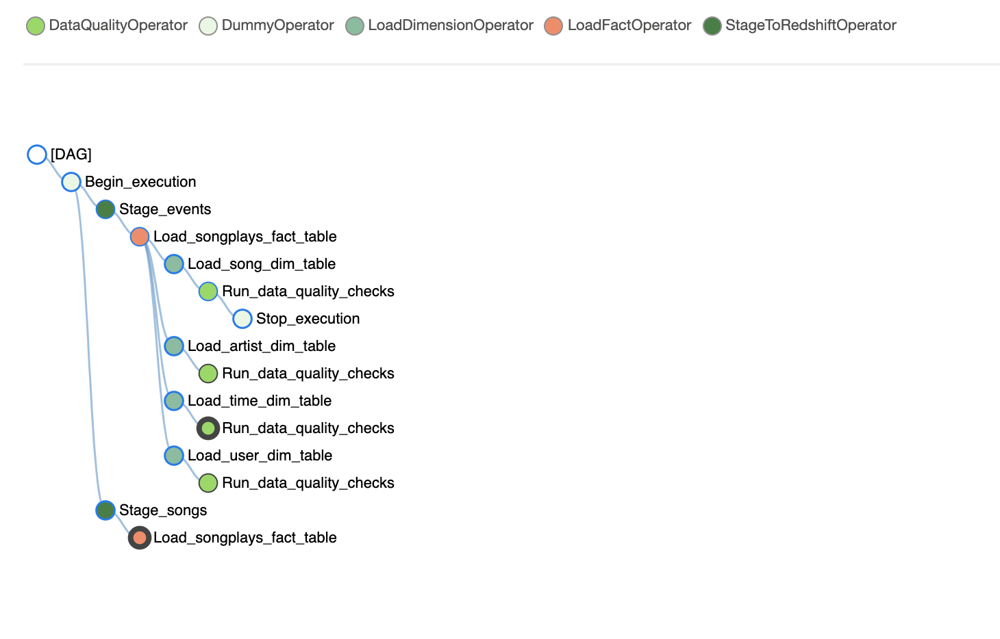

# Redshift Data Warehouse with Airflow
### Building an end to end ETL data pipeline with Airflow

To run the example code first make sure you have Airflow up and running. To do this, we will use Airflow running on Docker. We will use the formal instructions as provided from Airflow on how to run a Docker instance using the `Docker Compose`

### Airflow Docker

To deploy Airflow on Docker Compose, you should fetch [docker-compose.yaml](https://airflow.apache.org/docs/apache-airflow/stable/docker-compose.yaml).

```bash
curl -LfO 'https://airflow.apache.org/docs/apache-airflow/2.0.1/docker-compose.yaml'
```

This file contains several service definitions:

- `airflow-scheduler` - The [scheduler](https://airflow.apache.org/docs/apache-airflow/stable/scheduler.html) monitors all tasks and DAGs, then triggers the task instances once their dependencies are complete.
- `airflow-webserver` - The webserver available at `http://localhost:8080`.
- `airflow-worker` - The worker that executes the tasks given by the scheduler.
- `airflow-init` - The initialization service.
- `flower` - [The flower app](https://flower.readthedocs.io/en/latest/) for monitoring the environment. It is available at `http://localhost:8080`.
- `postgres` - The database.
- `redis` - [The redis](https://redis.io/) - broker that forwards messages from scheduler to worker.

All these services allow you to run Airflow with [CeleryExecutor](https://airflow.apache.org/docs/apache-airflow/stable/executor/celery.html). For more information, see [Basic Airflow architecture](https://airflow.apache.org/docs/apache-airflow/stable/concepts.html#architecture).

Some directories in the container are mounted, which means that their contents are synchronized between your computer and the container.

- `./dags` - you can put your DAG files here.
- `./logs` - contains logs from task execution and scheduler.
- `./plugins` - you can put your [custom plugins](https://airflow.apache.org/docs/apache-airflow/stable/plugins.html) here.


### Initializing Environment

Before starting Airflow for the first time, You need to prepare your environment, i.e. create the necessary files, directories and initialize the database.

On **Linux**, the mounted volumes in container use the native Linux filesystem user/group permissions, so you have to make sure the container and host computer have matching file permissions.

```bash
mkdir ./dags ./logs ./plugins
echo -e "AIRFLOW_UID=$(id -u)\nAIRFLOW_GID=0" > .env
```

On **all operating system**, you need to run database migrations and create the first user account. To do it, run.

```bash
docker-compose up airflow-init
```

After initialization is complete, you should see a message like below.

```bash
airflow-init_1       | Upgrades done
airflow-init_1       | Admin user airflow created
airflow-init_1       | 2.0.1
start_airflow-init_1 exited with code 0
```

The account created has the login `airflow` and the password `airflow`.

### Running Airflow

Now you can start all services:

```bash
docker-compose up
```

In the second terminal you can check the condition of the containers and make sure that no containers are in unhealthy condition:

```bash
$ docker ps
CONTAINER ID   IMAGE                  COMMAND                  CREATED          STATUS                    PORTS                              NAMES
247ebe6cf87a   apache/airflow:2.0.1   "/usr/bin/dumb-init …"   3 minutes ago    Up 3 minutes              8080/tcp                           compose_airflow-worker_1
ed9b09fc84b1   apache/airflow:2.0.1   "/usr/bin/dumb-init …"   3 minutes ago    Up 3 minutes              8080/tcp                           compose_airflow-scheduler_1
65ac1da2c219   apache/airflow:2.0.1   "/usr/bin/dumb-init …"   3 minutes ago    Up 3 minutes (healthy)    0.0.0.0:5555->5555/tcp, 8080/tcp   compose_flower_1
7cb1fb603a98   apache/airflow:2.0.1   "/usr/bin/dumb-init …"   3 minutes ago    Up 3 minutes (healthy)    0.0.0.0:8080->8080/tcp             compose_airflow-webserver_1
74f3bbe506eb   postgres:13            "docker-entrypoint.s…"   18 minutes ago   Up 17 minutes (healthy)   5432/tcp                           compose_postgres_1
0bd6576d23cb   redis:latest           "docker-entrypoint.s…"   10 hours ago     Up 17 minutes (healthy)   0.0.0.0:6379->6379/tcp             compose_redis_1
```

### Accessing the environment

After starting Airflow, you can interact with it in 3 ways;

- by running [CLI commands](https://airflow.apache.org/docs/apache-airflow/stable/usage-cli.html).
- via a browser using [the web interface](https://airflow.apache.org/docs/apache-airflow/stable/ui.html).
- using [the REST API](https://airflow.apache.org/docs/apache-airflow/stable/stable-rest-api-ref.html).

 ####  Running the CLI commands

You can also run [CLI commands](https://airflow.apache.org/docs/apache-airflow/stable/usage-cli.html), but you have to do it in one of the defined `airflow-*` services. For example, to run `airflow info`, run the following command:

```bash
docker-compose run airflow-worker airflow info
```

If you have Linux or Mac OS, you can make your work easier and download a optional wrapper scripts that will allow you to run commands with a simpler command.

```bash
curl -LfO 'https://airflow.apache.org/docs/apache-airflow/2.0.1/airflow.sh'
chmod +x airflow.sh
```

Now you can run commands easier.

```bash
./airflow.sh info
```

You can also use `bash` as parameter to enter interactive bash shell in the container or `python` to enter python container.

```bash
./airflow.sh bash
```


```bash
./airflow.sh python
```

### Cleaning up

To stop and delete containers, delete volumes with database data and download images, run:

```bash
docker-compose down --volumes --rmi all
```

**Notes**

> By default, the Docker Compose file uses the latest Airflow image ([apache/airflow](https://hub.docker.com/r/apache/airflow)). If you need, you can [customize and extend it](https://airflow.apache.org/docs/apache-airflow/stable/production-deployment.html#docker-image).

---

Once Airflow server is up and running as shown


You can open your browser and go to `http://localhost:8080/` and this should take you to the main login screen

To login use username `airflow` and password `airflow`


There are several example DAGs provided with the Docker install. The DAG from t his repo would be named `etl_dag`


You can inspect the DAG and you should see the different tasks associated:




---

# Project: Data Pipelines with Airflow

A music streaming company, Sparkify, has decided that it is time to introduce more automation and monitoring to their data warehouse ETL pipelines and come to the conclusion that the best tool to achieve this is Apache Airflow.

They have decided to bring you into the project and expect you to create high grade data pipelines that are dynamic and built from reusable tasks, can be monitored, and allow easy backfills. They have also noted that the data quality plays a big part when analyses are executed on top the data warehouse and want to run tests against their datasets after the ETL steps have been executed to catch any discrepancies in the datasets.

The source data resides in S3 and needs to be processed in Sparkify's data warehouse in Amazon Redshift. The source datasets consist of JSON logs that tell about user activity in the application and JSON metadata about the songs the users listen to.

# Project Overview

This project will introduce you to the core concepts of Apache Airflow. To complete the project, you will need to create your own custom operators to perform tasks such as staging the data, filling the data warehouse, and running checks on the data as the final step. 

We have provided you with a project template that takes care of all the imports and provides four empty operators that need to be implemented into functional pieces of a data pipeline. The template also contains a set of tasks that need to be linked to achieve a coherent and sensible data flow within the pipeline.

You'll be provided with a helpers class that contains all the SQL transformations. Thus, you won't need to write the ETL yourselves, but you'll need to execute it with your custom operators.


Example DAG

# Add Airflow Connections

Here, we'll use Airflow's UI to configure your AWS credentials and connection to Redshift.

1. To go to the Airflow UI:
   - You can use the Project Workspace here and click on the blue **Access Airflow** button in the bottom right. 
   - If you'd prefer to run Airflow locally, open [http://localhost:8080](http://localhost:8080/) in Google Chrome (other browsers occasionally have issues rendering the Airflow UI).
2. Click on the **Admin** tab and select **Connections**.


1. Under **Connections**, select **Create**.


1. On the create connection page, enter the following values:

   - **Conn Id**: Enter `aws_credentials`.
   - **Conn Type**: Enter `Amazon Web Services`.
   - **Login**: Enter your **Access key ID** from the IAM User credentials you downloaded earlier.
   - **Password**: Enter your **Secret access key** from the IAM User credentials you downloaded earlier.

   Once you've entered these values, select **Save and Add Another**.


1. On the next create connection page, enter the following values:

   - **Conn Id**: Enter `redshift`.
   - **Conn Type**: Enter `Postgres`.
   - **Host**: Enter the endpoint of your Redshift cluster, excluding the port at the end. You can find this by selecting your cluster in the **Clusters** page of the Amazon Redshift console
   - **Schema**: Enter schema name. This is the Redshift database you want to connect to.
   - **Login**: Enter Redshift username.
   - **Password**: Enter the password you created when launching your Redshift cluster.
   - **Port**: Enter `5439`.

   Once you've entered these values, select **Save**.


Awesome! You're now all configured to run Airflow with Redshift.

**WARNING: Remember to DELETE your cluster each time you are finished working to avoid large, unexpected costs.**


# Datasets

For this project, you'll be working with two datasets. Here are the s3 links for each:

- Log data: `s3://udacity-dend/log_data`
- Song data: `s3://udacity-dend/song_data`


